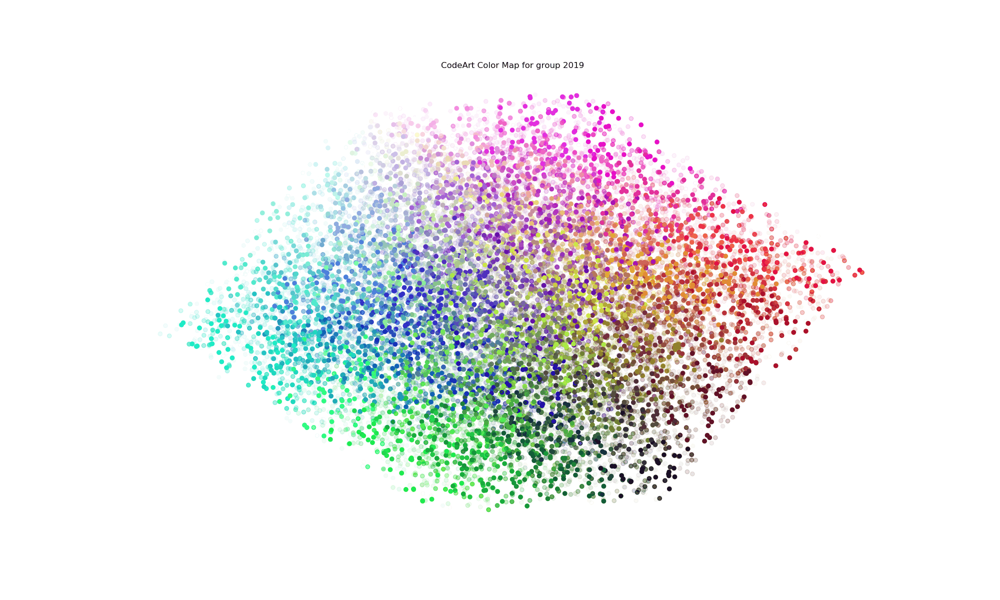

# ColorArt Examples

This is an examples repository to supplement [codeart](https://github.com/vsoch/codeart).
The repository was getting large so I decided to move image and data files over here.

## Dockerfiles

The Dockerfiles [dinosaur dataset](https://github.com/vsoch/dockerfiles) has about 100K Dockerfiles, 
and this small example shows creating visualizations for them. The [interactive version](https://vsoch.github.io/codeart-examples/dockerfiles/web/) isnt' very useful here because we only have one file type, and the range of colors
is limited from greens to blues. This project helped to develop the [sorted interactive version](https://vsoch.github.io/codeart-examples/dockerfiles/sorted/) of the colormap.

## Parse Repo

The [parse_repo](parse_repo) folder shows how to parse a repository (spack)
and then generate a color gradient lookup. The first attempt at the color grid
[can be seen here](https://vsoch.github.io/codeart-examples/parse_repo/web/)
and this was updated to better organize, [seen here](https://vsoch.github.io/codeart-examples/parse_repo/sorted/)

## Parse by Year

Is an example project to use codeart to parse a large Python code base, determine
year of creation using the GitHub api, and then break into groups based on the year.
This small project helped me to develop the interactive colomap example, which
you can view [here](https://vsoch.github.io/codeart-examples/parse_by_year/).

The example also generates static images, along with a gif (animation) to
show the change in data over time.

Of course this was impossible to explore, hence why I made the interactive version.

## Derive Colormap

The [derive_colormap](derive_colormap) folder an example to show working on deriving a colormap from a set of embeddings. 
This means that we start with 3d, project to 2d, and then use Voronoi to
fill border cells. I wound up doing something different, but the notebook
is useful to get someone started with a similar project.

## Parse Folders

The [parse_folders](parse_folders) is a similar effort to "Parse Repo" above,
but instead we parse folders on our local file system and generate a colors
gradient. This is the color gradient across all extensions for the model:

Or instead, you can generate an [interactive version](https://vsoch.github.io/codeart-examples/parse_repo/web/)
that allows for mousing over colors to see terms, and clicking on the list
of extensions to see relevant terms. The opacity corresponds to the relative
count of the term for the extension. For spack, most terms will be derived
from Python files.

### Interactive

The [interactive version](https://vsoch.github.io/codeart-examples/parse_repo/web/) shows the interactive color grid, where groups (in this case extensions) are colored based on salience. Click an extension to see relevant terms in the embeddings model.

### Abstract
The abstract versions, including those for [no extension](https://vsoch.github.io/codeart-examples/parse_repo/spack/codeart.html), [python](https://vsoch.github.io/codeart-examples/parse_repo/spack/codeart.py.html) and [patch](https://vsoch.github.io/codeart-examples/parse_repo/spack/codeart.patch.html) files are graphics generated with pictures of the code themself.
